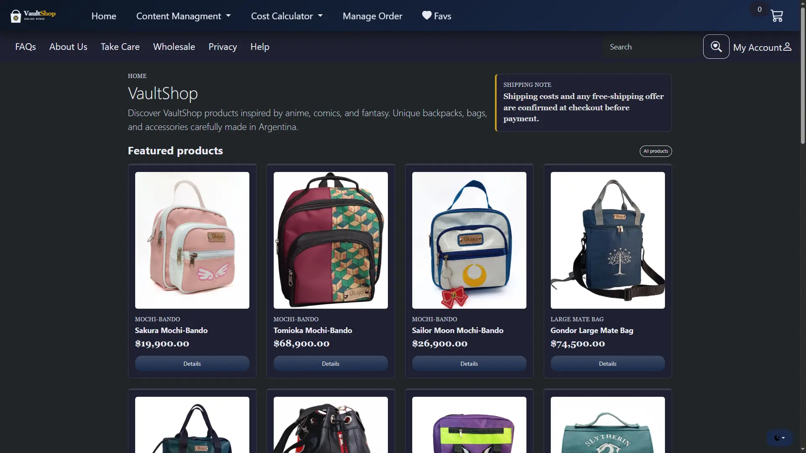
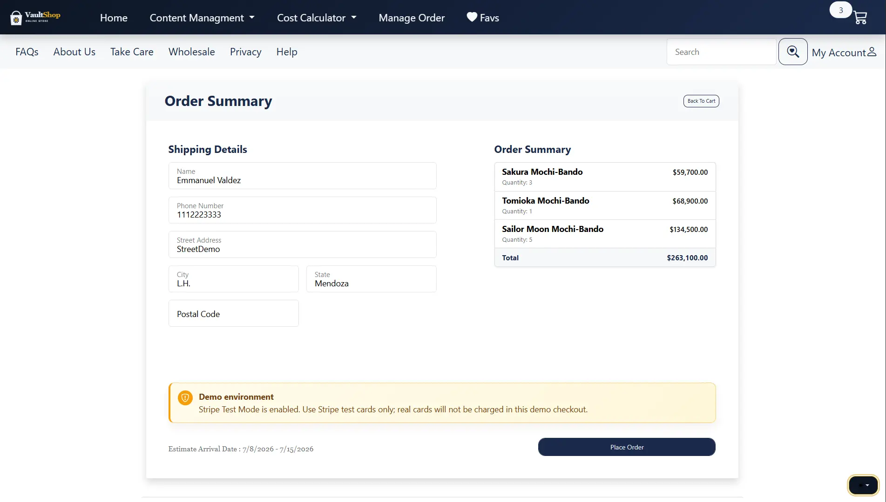
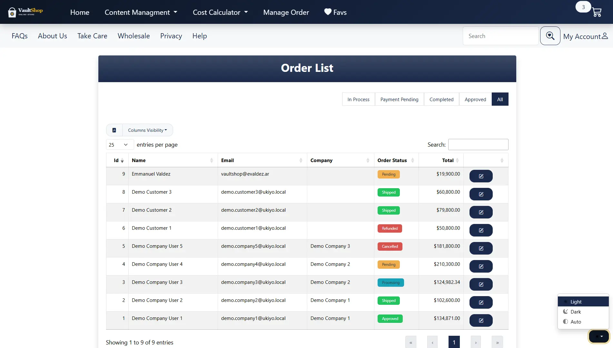
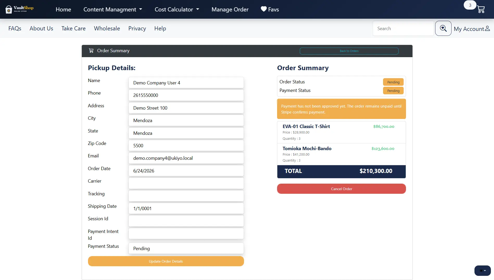
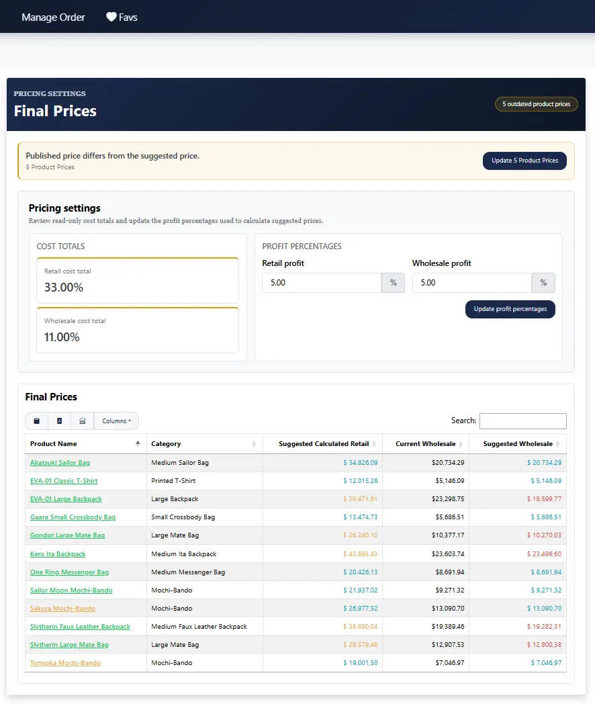

# VaultShop - ASP.NET Core E-commerce Case Study

**Live demo:** https://vaultshop.evaldez.ar


VaultShop is a portfolio e-commerce project for custom anime-inspired backpacks and accessories. It started as a traditional ASP.NET Core MVC store and is now a production-style case study with PostgreSQL, Docker Compose, MinIO/S3-compatible image storage, Stripe payments, automated tests, backup/restore validation, lightweight monitoring, and deployment-oriented hardening.

The application is live and functional. Current work focuses on keeping the portfolio demo explainable, recoverable, and honest about its remaining production gaps.

## Screenshots

Selected current flows for backend/portfolio review.

<p>
  
  
</p>
<p>
  
  
</p>
<p>
  
</p>

## Features

- Customer storefront with product browsing, favorites, cart, checkout, and retail/wholesale pricing.
- Admin product, category, inventory, company, order, and price-management flows.
- Admin pricing calculator for fabrics, garment hardware, packaging, fixed costs, separate retail/wholesale percentage costs, profit margins, and final prices.
- Final price dashboard that compares current storefront prices with calculated cost-based suggestions.
- ASP.NET Core Identity with roles for Customer, Company, Employee, and Admin users.
- Stripe Checkout integration with webhook-based payment status updates.
- Product image upload validation, resizing, metadata persistence, and storage abstraction.
- Localization for Spanish and English.

## Tech Stack

- ASP.NET Core 8 MVC
- Entity Framework Core with PostgreSQL/Npgsql
- ASP.NET Core Identity + Facebook OAuth
- Stripe Checkout
- Resend email provider with fake/local email mode
- Docker and Docker Compose
- MinIO/S3-compatible product image storage
- xUnit, Moq, and SQLite in-memory tests for selected service/integration coverage

## Architecture Highlights

- PostgreSQL is the active database provider. Earlier SQL Server-specific runtime assumptions were removed; old SQL Server migration files are intentionally not kept in the active repository.
- The admin pricing calculator uses `PricingCalculatorService` and EF Core queries instead of SQL Server views/triggers.
- Retail and wholesale percentage costs are modeled separately; wholesale suggestions include wholesale profit plus wholesale percentage costs in the final margin formula.
- Product image persistence is behind `IImageStorageService`; the app supports local filesystem storage and MinIO.
- `ProductImage.ObjectKey` is the storage identity for uploaded images. `ImageUrl` is used only as the browser display URL.
- Checkout order creation is handled by `CheckoutService` and wrapped in a transaction to avoid partial orders.
- Stripe Checkout confirmation is hardened: signed webhooks and server-side Checkout Session reads are the trusted payment sources; browser redirects only trigger verification, `session_id` must match the stored order session, stale/terminal sessions are ignored, and unpaid orders cannot be shipped.
- Customer orders remain `Pending / Pending` until Stripe reports `paid`; Company delayed-payment orders can be prepared before payment, but shipping remains blocked until `PaymentStatus == Approved`.
- Production-like environments can disable startup migrations with `Database__RunMigrationsOnStartup=false`.
- The public deployment runs behind Nginx HTTPS reverse proxy on a Linux VPS, with PostgreSQL and MinIO kept off the public internet.
- Public branding values, including `/site.webmanifest` icon paths, are configurable through `Branding__...` so preview/demo and future private deployments can use different names/assets without branching the codebase.
- Public theme colors are configurable through validated hex `Theme__...` values emitted as CSS custom properties.

See the architecture notes in [`docs/architecture.md`](docs/architecture.md).

## Case Study

See [`docs/case-study.md`](docs/case-study.md) for a concise project case study covering goals, decisions, operations evidence, and current limitations.

## Project Structure

```text
VaultShop.Web/          ASP.NET Core MVC web app
VaultShop.DataAccess/   EF Core DbContext, repositories, migrations
VaultShop.Models/       Domain models and view models
VaultShop.Utility/      Shared constants and infrastructure helpers
VaultShop.Tests/        Automated tests
docs/                  Architecture, operations notes, case study, and screenshots
```

## Configuration

Configuration is supplied through environment variables or ignored `.env` files. Do not commit real secrets.

Common variables:

```text
ConnectionStrings__DefaultConnection
Database__RunMigrationsOnStartup
Stripe__SecretKey
Stripe__PublishableKey
Stripe__WebhookSecret
Facebook__AppId
Facebook__AppSecret
Email__Provider
Email__UseFakeEmailSender
Resend__ApiKey
Resend__FromEmail
Seed__AdminEmail
Seed__AdminPassword
SiteUrl
Branding__PublicName
Branding__LogoPath
Branding__LogoDarkPath
Branding__MarkPath
Branding__AppleTouchIconPath
Branding__SocialPreviewImagePath
Branding__TwitterSite
Theme__Primary
Theme__PrimaryDark
Theme__Accent
Theme__Surface
Theme__SurfaceDark
ImageStorage__Provider
ImageStorage__Minio__Endpoint
ImageStorage__Minio__UseSsl
ImageStorage__Minio__BucketName
ImageStorage__Minio__AccessKey
ImageStorage__Minio__SecretKey
ImageStorage__Minio__PublicBaseUrl
```

For local/demo email behavior, use `Email__Provider=Fake`. For real transactional email, use `Email__Provider=Resend` with a private `Resend__ApiKey` and verified sender.

Development-only manual payment approval exists for local testing only: it requires `ASPNETCORE_ENVIRONMENT=Development` and `Payments__AllowDevelopmentManualApproval=true`. Keep it disabled in preview and production.

Branding and theme values are safe to override per deployment. Private brand assets should be mounted or copied outside git under the configured public paths; theme values must be hex colors.

## Run Locally

Prerequisites:

- .NET 8 SDK
- PostgreSQL or Docker Compose
- Stripe test keys if testing checkout payments
- Facebook OAuth credentials if testing Facebook login

1. Restore dependencies.

```powershell
dotnet restore VaultShop.sln
```

2. Create `VaultShop.Web/.env` with local configuration values, or use `.env.compose` for Docker Compose.

3. Build the solution.

```powershell
dotnet build VaultShop.sln
```

4. Run the web app.

```powershell
dotnet run --project VaultShop.Web/VaultShop.Web.csproj --launch-profile https
```

5. Open the local site.

```text
https://localhost:7189/es-AR
```

When `Database__RunMigrationsOnStartup=true`, the app applies pending migrations, ensures roles, and creates the admin user from `Seed__AdminEmail` and `Seed__AdminPassword`. Production configuration defaults this to `false` so schema changes are intentional.

## Docker Compose

The Compose stack runs the web app, PostgreSQL 16, MinIO object storage, and a short-lived MinIO initialization container.

1. Copy the sample Compose environment file and replace placeholders.

```powershell
Copy-Item .env.compose.example .env.compose
```

2. Build and start the stack.

```powershell
docker compose --env-file .env.compose up --build
```

3. Open the app.

```text
http://localhost:8080/es-AR
```

Compose persists PostgreSQL data in `postgres-data` and MinIO objects in `minio-data`. For a fresh local database, temporarily enable startup initialization with `DATABASE_RUN_MIGRATIONS_ON_STARTUP=true`, then set it back to `false` if you want production-like behavior.

Stop containers without deleting data:

```powershell
docker compose --env-file .env.compose down
```

Delete local PostgreSQL and MinIO volumes only when intentionally resetting the local stack:

```powershell
docker compose --env-file .env.compose down -v
```

For Compose image storage, use MinIO settings like:

```env
ImageStorage__Provider=Minio
ImageStorage__Minio__Endpoint=minio:9000
ImageStorage__Minio__UseSsl=false
ImageStorage__Minio__BucketName=product-images
ImageStorage__Minio__PublicBaseUrl=http://localhost:9000/product-images
```

`ImageStorage__Minio__Endpoint` is used by the web container over the Docker network. `ImageStorage__Minio__PublicBaseUrl` is the browser-facing URL for product image display.

Do not expose PostgreSQL or the MinIO console directly on a public server.

## Tests

Run the automated tests:

```powershell
dotnet test VaultShop.sln
```

Current tests focus on high-value service behavior: upload validation, checkout rules, transactional order creation, Stripe session creation, payment status updates, and pricing calculator formulas/publish behavior.

## Deployment Direction

The current public deployment runs on an Ubuntu 24.04 Oracle/VPS server using Docker Compose behind host-level Nginx with HTTPS.

Current deployment shape:

- Keep PostgreSQL and MinIO private on the Docker network.
- Expose only HTTP/HTTPS publicly through a reverse proxy.
- Use private environment files or host secrets for configuration.
- Keep `Database__RunMigrationsOnStartup=false` and run migrations intentionally.
- Serve product images from MinIO through the public HTTPS domain instead of exposing the MinIO console.

Remaining deployment hardening:

- Automate PostgreSQL and MinIO backups after the manual restore-tested process.
- Expand monitoring beyond uptime/TLS if the project starts handling real usage.
- Verify payment webhooks and key user flows after every deployment change.

Operations runbook: [`docs/operations/runbook.md`](docs/operations/runbook.md).

## Current Limitations / Next Work

- Backups and restore have been tested manually; backup automation and freshness checks are planned later.
- Manual browser checks should still be repeated after deployment changes for Stripe paid/unpaid flows, branding/theme overrides, and fulfillment guards.
- The storefront frontend is functional, but backend/deployment evidence remains the main portfolio value.

## Portfolio Scope

This is a production-style portfolio project, not an enterprise-scale production system. The focus is demonstrating practical .NET backend skills: database migration, secure file upload handling, object storage, payments, testing, Docker-based deployment, configuration, and operational basics.
