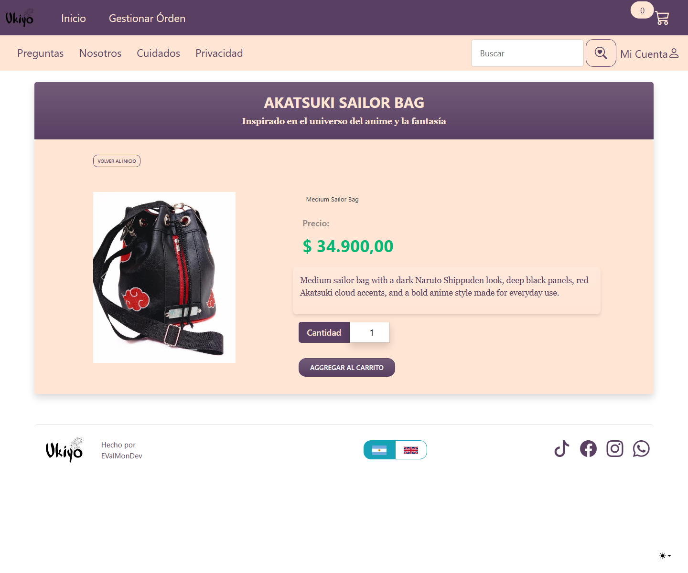
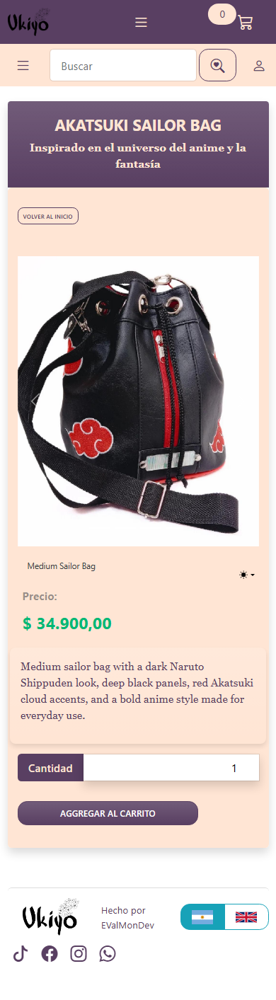
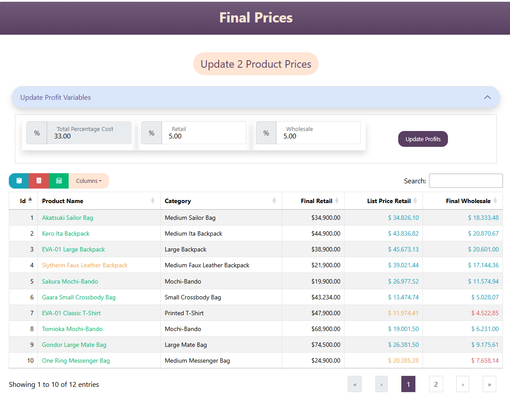

# Ukiyo - E-commerce Project

**Live demo:** https://ukiyo.bsite.net


## Screenshots

### Desktop


### Mobile


### Product Detail





### Admin Final Prices



## Project Description

Ukiyo is an e-commerce platform specialized in custom anime-inspired backpacks and accessories. The platform features:

### Core Features

- **Customer Store**: Public-facing shop where customers can browse, search, and purchase products with support for both retail and wholesale pricing.

- **Admin Price Calculator**: The administrative panel allows adding products with detailed production costs including:
  - **Fabrics**: Material costs per product
  - **Garment Hardware**: Buttons, zippers, buckles, and other hardware components
  - **Packaging**: Per-category packaging costs
  - **Fixed Costs**: Monthly operational expenses (taxes, rent, utilities, etc.)
  - **Percentage Costs**: Platform fees, payment processing fees, etc.
  
  The system automatically calculates the optimal cost by summing all production expenses and applying profit margins. It then determines:
  - **Fair Wholesale Price**: Based on actual production costs plus a percentage
  - **Suggested Retail Price**: Wholesale price plus an additional margin
  
  **Note**: For marketing and competitive reasons, the final retail price is left to the admin's discretion.

- **Admin Final Price Dashboard**: Compares current retail and wholesale prices against calculated cost-based prices, highlights outdated values, supports PDF export, column visibility, availability filters, and controlled price updates.

- **Multi-Company Support**: Different companies can manage their own users, and users belonging to the same company can collaboratively manage orders and inventory.

### User Roles

- **Customer**: Regular shoppers who can purchase products
- **Company**: Business accounts with multiple users who can manage orders together
- **Employee**: Company staff members with order management capabilities
- **Admin**: Platform administrators with full system access

## Current Status (June 2026)

Ukiyo is an active portfolio/case-study project. The public demo is published, manual regression testing has been completed, and recent hardening work focused on safer uploads, structured logging, email configuration, checkout/order separation, automated tests, transactional order creation, and Stripe webhook payment confirmation.

### Publish Readiness

- [x] Full pending manual testing pass completed.
- [x] Targeted regression testing for the May 30 fixes completed.
- [x] Company soft-delete, checkout guards, order access, product availability, calculator deletes, localization metadata, and normal login/cart flows verified manually.
- [x] Latest build passed before publish readiness update.

### Documentation / Presentation TODO

- [x] Add favicon
- [x] Add screenshots or GIFs of the project, especially mobile views
- [x] Add a step-by-step "How to run locally" section
- [x] Confirm license and update the license badge

### Production Hardening Progress

- [x] Harden product image uploads with extension, size, content-type, decodable-image, generated-name, and controlled-path validation.
- [x] Replace important `Console.WriteLine` usage with `ILogger` and structured logging.
- [x] Add focused logs around checkout, Stripe payment/refund flows, admin order changes, product image deletion, product availability changes, demo data seeding, and startup database initialization failures.
- [x] Avoid logging secrets or sensitive user/payment values such as Stripe keys, Stripe session IDs, payment intent IDs, session URLs, passwords, emails, phone numbers, and addresses.
- [x] Add configurable email sender support with explicit fake/local mode and Resend transactional email integration.
- [x] Extract checkout summary and order creation logic from controllers into `CheckoutService`.
- [x] Wrap checkout order creation in an EF Core transaction to avoid partial orders.
- [x] Add Stripe payment session abstraction and webhook-based payment status updates.
- [x] Add automated tests for upload validation, checkout rules, transactional order creation, Stripe session creation, and payment status updates.
- [x] Add configurable startup database initialization so production can disable automatic migrations/schema setup.
- [x] Add Dockerfile support for repeatable production-style container builds.

### Post-Portfolio Publish TODO

- [x] Add GitHub Actions CI for restore, build, and test.
- [x] Add Docker support in upcoming releases.
- [ ] Optionally add Serilog or another external sink for persisted structured logs.
- [ ] Add centralized exception-handling middleware.

### Environment Variables Setup (.env)

The project uses **DotNetEnv** to manage secrets. The `.env` file is in `.gitignore` and is NOT pushed to GitHub.

**Required variables in `UkiyoMono/.env`:**

```env
# Database Connection
ConnectionStrings__DefaultConnection=your_connection_string
# Optional: local/demo defaults to true. Production defaults to false in appsettings.Production.json.
# Database__RunMigrationsOnStartup=true

# Stripe Payment Gateway
Stripe__SecretKey=your_stripe_secret_key
Stripe__PublishableKey=your_stripe_publishable_key
Stripe__WebhookSecret=your_stripe_webhook_secret

# Facebook OAuth
Facebook__AppId=your_facebook_app_id
Facebook__AppSecret=your_facebook_app_secret

# Email Configuration
Email__Provider=Fake
Email__UseFakeEmailSender=true
Resend__ApiKey=re_xxxxxxxxx
Resend__FromEmail=onboarding@resend.dev

# Seed Admin User (created on first run)
Seed__AdminEmail=your_admin_email
Seed__AdminPassword=your_admin_password

# Public Site URL used for canonical URLs, Open Graph, robots.txt, and sitemap.xml
SiteUrl=https://ukiyo.bsite.net

# Social Media Links
Social__TikTok=your_tiktok_link
Social__WhatsApp=your_whatsapp_link
Social__Instagram=your_instagram_link
Social__Facebook=your_facebook_link
Social__DevLink=your_devlink_link
```

## How to Run Locally

### Prerequisites

- .NET 8 SDK
- SQL Server or SQL Server Express LocalDB
- Stripe test keys
- Facebook OAuth app credentials, if testing Facebook login

### Steps

1. Clone the repository and enter the project folder.

```powershell
git clone <repository-url>
cd UkiyoMono
```

2. Create `UkiyoMono/.env` with the required variables listed above.

3. Restore dependencies.

```powershell
dotnet restore UkiyoDesigns.sln
```

4. Build the solution.

```powershell
dotnet build UkiyoDesigns.sln
```

5. Run the web app.

```powershell
dotnet run --project UkiyoMono/UkiyoDesignsWeb.csproj --launch-profile https
```

6. Run the automated tests.

```powershell
dotnet test UkiyoDesigns.sln
```

7. Open the local site.

```text
https://localhost:7189/es-AR
```

When `Database__RunMigrationsOnStartup=true`, the application applies pending EF Core migrations, creates the SQL views and triggers, ensures required roles, and creates the admin user from `Seed__AdminEmail` and `Seed__AdminPassword` on startup. This remains enabled for local development. Production defaults to `false` in `appsettings.Production.json`; enable it only when you intentionally want the app process to apply startup database changes.

Demo catalog, users, shopping activity, and orders are seeded manually from the Admin product page through guarded admin-only actions.

## Docker

Build the web app image from the repository root:

```powershell
docker build -t ukiyo-designs-web:latest .
```

Run the container on port 8080 and provide configuration through environment variables:

```powershell
docker run --rm -p 8080:8080 `
  -e ASPNETCORE_ENVIRONMENT=Production `
  -e Database__RunMigrationsOnStartup=false `
  -e ConnectionStrings__DefaultConnection="your_connection_string" `
  -e Stripe__SecretKey="your_stripe_secret_key" `
  -e Stripe__PublishableKey="your_stripe_publishable_key" `
  -e Stripe__WebhookSecret="your_stripe_webhook_secret" `
  -e Email__Provider=Fake `
  ukiyo-designs-web:latest
```

The image listens on `http://+:8080`, runs as the non-root user provided by the official .NET runtime image, and defaults `Database__RunMigrationsOnStartup=false` for production-like runs. Do not bake secrets or real environment values into the image; pass them from the hosting platform or deployment pipeline.


### Docker Compose with SQL Server

This milestone is intentionally SQL Server only because the app currently uses EF Core SQL Server (`UseSqlServer`). PostgreSQL, MinIO, and image-storage redesigns are not part of this step.

1. Copy the Compose sample environment file and replace the placeholder values:

```powershell
Copy-Item .env.compose.example .env.compose
```

Use the same strong value for `MSSQL_SA_PASSWORD` and the password inside `ConnectionStrings__DefaultConnection`. The connection string host must remain `sqlserver` because that is the SQL Server service name on the Compose network.

2. Build and start the app plus SQL Server:

```powershell
docker compose --env-file .env.compose up --build
```

3. Open the site:

```text
http://localhost:8080/es-AR
```

Compose runs the web app with `ASPNETCORE_ENVIRONMENT=Production`, exposes the app on `APP_HTTP_PORT` (default `8080`), starts SQL Server 2022 Developer Edition, and persists database files in the `sqlserver-data` Docker volume.

`Database__RunMigrationsOnStartup` defaults to `false` to match production-like safety: the app process should not unexpectedly change schema on every container start. For a fresh local Compose database, you may temporarily set `DATABASE_RUN_MIGRATIONS_ON_STARTUP=true` in `.env.compose` so the existing startup initializer applies migrations, SQL views/triggers, roles, and the seed admin user. Set it back to `false` after initialization if you want to keep Compose closer to production behavior.

Stop containers without deleting the database volume:

```powershell
docker compose --env-file .env.compose down
```

Delete the local SQL Server data volume only when you intentionally want a clean database:

```powershell
docker compose --env-file .env.compose down -v
```

### Email Sender

The application uses ASP.NET Core Identity's `IEmailSender` abstraction for account confirmation, password reset, and email-change messages.

For local/demo environments, keep `Email__Provider=Fake`. This registers `FakeEmailSender`, which logs that an email was intercepted but does not send the message or log the email address/body.

For real transactional email, set `Email__Provider=Resend`, replace `Resend__ApiKey=re_xxxxxxxxx` with your real Resend API key in your private `.env` or hosting environment variables, and set `Resend__FromEmail` to a verified sender/domain. The default `onboarding@resend.dev` is useful only for initial Resend testing.

When no provider is configured and `Email__UseFakeEmailSender=false`, the app uses `UnconfiguredEmailSender`, which fails explicitly if email sending is requested. This avoids silently dropping production emails.

Do not commit SMTP credentials or email provider API keys.

### Payments

Stripe Checkout is isolated behind `IPaymentSessionService`, so controllers do not build Stripe session options directly. Payment status updates are handled through a Stripe webhook with signature validation using `Stripe__WebhookSecret`, rather than trusting only the browser redirect after checkout.

### Database Architecture

The database uses **SQL Views** and **Triggers** for the price calculation system:

**Views:**
- `FixedCostMonthlyView`: Monthly fixed costs calculation
- `TotalPercentageCostView`: Sum of all percentage-based costs
- `CostByProductView`: Total cost breakdown per product (fabrics + hardware + packaging + fixed costs)
- `FinalPriceView`: Calculates wholesale and retail prices based on costs and profit margins

**Triggers:**
- Automatically update unit totals when fabrics, hardware, or packaging quantities/prices change
- Update product-level totals (FabricByProduct, GarmentHardwareByProduct, PackagingByCategory)
### Project Structure

```
UkiyoMono/           # ASP.NET Core MVC Web App
├── Areas/
│   ├── Admin/       # CRUD for products, categories, price calculator
│   ├── Customer/    # Home, Cart, Favorites
│   └── Identity/    # Auth (Login, Register, Manage)
├── Resources/       # .resx files for localization (es-AR/en-US)
├── Program.cs      # Entry point with DotNetEnv configuration
└── .env            # Local secrets (DO NOT COMMIT)

Ukiyo.DataAccess/   # DbContext, Repositories, Migrations
Ukiyo.Models/       # Entities and ViewModels
Ukiyo.Utility/      # Helpers (Stripe, Email, SD)
```

### Tech Stack

- ASP.NET Core 8.0 MVC
- Entity Framework Core (SQL Server)
- Identity + Facebook OAuth
- Stripe Payment Gateway
- Localization (Spanish/English)
- DotNetEnv for secrets management

### Database Entities

**Core:** Product, Category, Company, ApplicationUser, ShoppingCart, OrderHeader, OrderDetail, ProductImage

**Calculator:**
- Fabric, FabricByProduct, UnitFabricByProduct
- GarmentHardware, GarmentHardwareByProduct, UnitGarmentHardwareByProduct
- Packaging, PackagingByCategory, UnitPackagingByCategory
- FixedCost, PercentageCost, PercentageProfit

**SQL Views:** FixedCostMonthly, TotalPercentageCost, CostByProduct, FinalPrice
