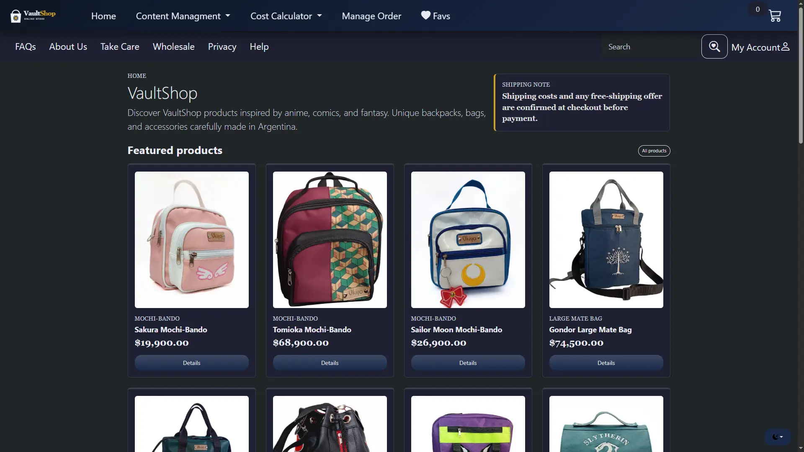
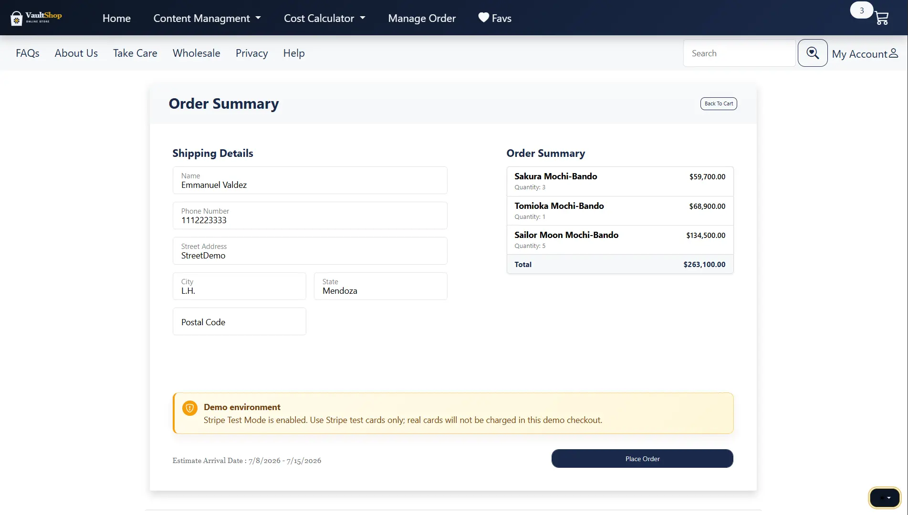
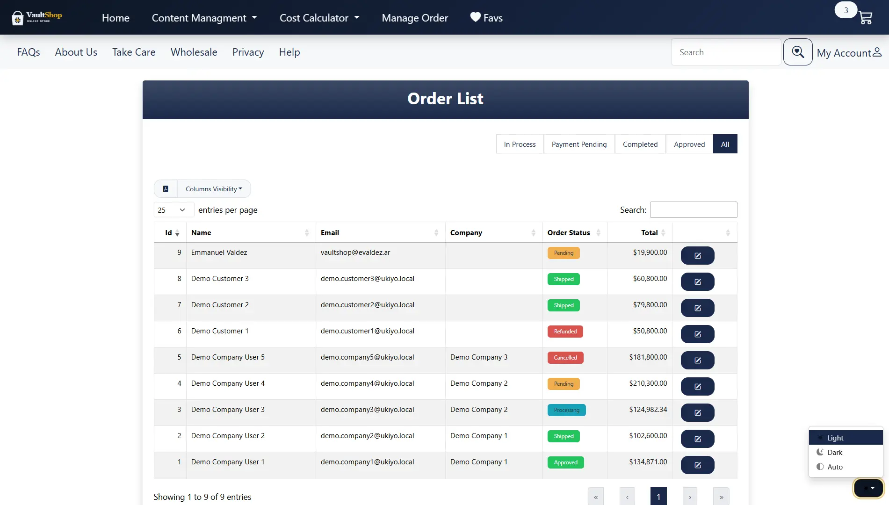
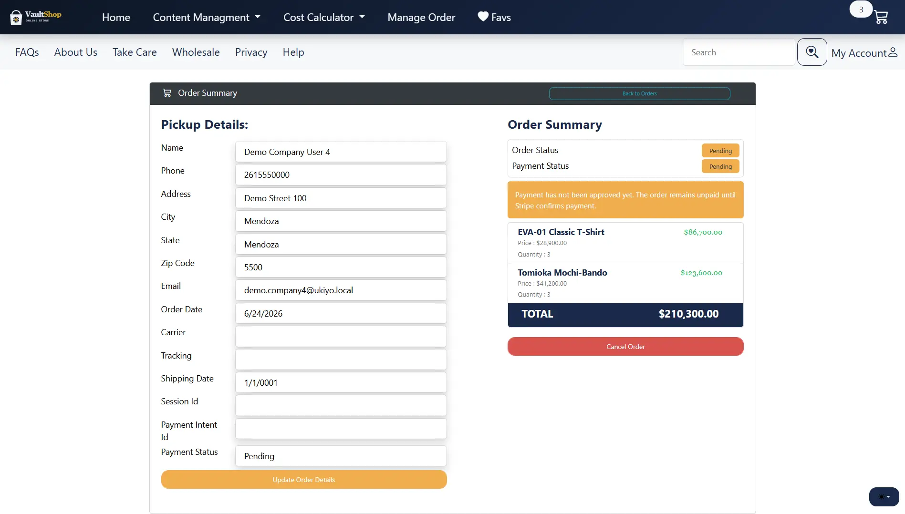
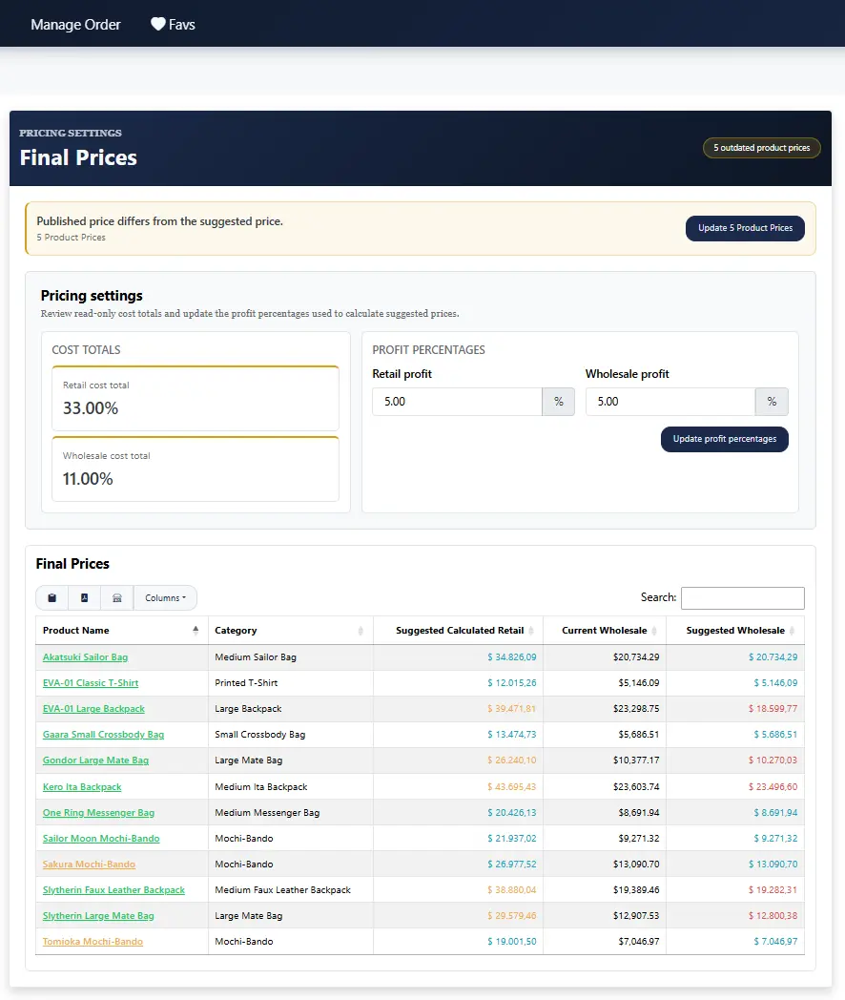

# VaultShop - ASP.NET Core E-commerce Case Study

**Live demo:** https://vaultshop.evaldez.ar


VaultShop is a portfolio e-commerce project for custom anime-inspired backpacks and accessories. It started as a traditional ASP.NET Core MVC store and is now a production-style case study with PostgreSQL, Docker Compose, MinIO/S3-compatible image storage, Stripe and Mercado Pago payments, automated tests, backup/restore validation, lightweight monitoring, and deployment-oriented hardening.

The application is live and functional. Current work focuses on keeping the portfolio demo explainable, recoverable, and honest about its remaining production gaps.

## Screenshots

Selected current flows for backend/portfolio review.

<p>
  
  
</p>
<p>
  
  
</p>
<p>
  
</p>

## Features

- Customer storefront with product browsing (paginated, 12/page), search (case/accent-insensitive), favorites, cart, checkout, and retail/wholesale pricing.
- Admin product, category, company, order, and price-management flows.
- Admin pricing calculator for fabrics, hardware, packaging, fixed costs, separate retail/wholesale percentage costs, profit margins, and final prices; dashboard compares live prices vs cost-based suggestions.
- Internal order summary ("Resumen de pedido") — HTML view + QuestPDF PDF download, fiscal snapshot for Company orders, explicitly non-fiscal.
- ASP.NET Core Identity with roles Customer/Company/Employee/Admin, Google OAuth, rate limiting + lockout, branded 404/500.
- Stripe Checkout + Mercado Pago Checkout Pro + Bank Transfer, provider-verified webhooks/browser returns, refunds on cancellation.
- Product image upload validation, resizing, metadata persistence via `IImageStorageService` (Local/MinIO).
 - Localization es-AR/en-US; health endpoints (`/health/live`, `/health/ready`) for liveness/readiness probes.
 - Deployment version stamped at build (`APP_VERSION`/`APP_BUILD_DATE`) with admin-only page (`/Admin/System/Version`) comparing deployed commit vs GitHub `main` (cached 5 min).

## Tech Stack

- ASP.NET Core 8 MVC · EF Core 8 + Npgsql (PostgreSQL 16)
- ASP.NET Core Identity + Google OAuth · Rate limiting (`System.Threading.RateLimiting`) + lockout · Health checks
- Stripe Checkout + Mercado Pago Checkout Pro + Bank Transfer
- Resend email (Fake/Unconfigured) + QuestPDF (order summary PDF, community license)
- Docker & Docker Compose (platform + per-store stacks) + Nginx HTTPS proxy + MinIO S3
- xUnit + Moq + SQLite in-memory (159 tests, service/integration/HTTP)

## Architecture Highlights

- PostgreSQL is the active database provider. Earlier SQL Server-specific runtime assumptions were removed; old SQL Server migration files are intentionally not kept in the active repository.
- The admin pricing calculator uses `PricingCalculatorService` and EF Core queries instead of SQL Server views/triggers.
- Retail and wholesale percentage costs are modeled separately; wholesale suggestions include wholesale profit plus wholesale percentage costs in the final margin formula.
- Product image persistence is behind `IImageStorageService`; the app supports local filesystem storage and MinIO.
- `ProductImage.ObjectKey` is the storage identity for uploaded images. `ImageUrl` is used only as the browser display URL.
- Checkout via `CheckoutService` is transactional (no partial orders); Company delayed-payment still inside the same transaction.
- Payment confirmation is provider-verified: signed Stripe/Mercado Pago webhooks + server-side session/preference/payment lookups; browser redirects only trigger verification, `session_id`/`preference_id` must match the stored order, stale/terminal sessions ignored, unpaid not shippable; refund on cancellation (fail-open, logged).
- Customer orders stay `Pending/Pending` until provider reports `paid`; Company delayed-payment can prepare before payment but shipping blocked until `PaymentStatus == Approved`.
- Pagination is in-memory `PagedList<T>` (ordered by `Id`, `pageNumber` param, `#productos` anchor, shared `_Pager`).
- Order summary PDF is QuestPDF from persisted `OrderHeader` snapshot; company fiscal fields (razón social/domicilio required, CUIT optional) snapshotted at checkout.
- Security: global fixed-window `RateLimiter` + stricter `Login` policy (per-IP, 429), `Identity Lockout` from config, `UseStatusCodePagesWithReExecute` branded 404/500, `ForwardedHeaders` for OAuth behind Nginx; `DataProtection` keys persisted when configured.
- Production-like environments can disable startup migrations with `Database__RunMigrationsOnStartup=false`.
- The public deployment runs behind Nginx HTTPS reverse proxy on a Linux VPS, with PostgreSQL and MinIO kept off the public internet.
- Shared platform deployments (VaultShop + UkiyoStudio) isolate each store in its own PostgreSQL database and MinIO bucket with scoped credentials, so one store cannot read another store's data; backup scripts and MinIO API users are per-store.
- Public branding values, including `/site.webmanifest` icon paths, are configurable through `Branding__...` so preview/demo and future private deployments can use different names/assets without branching the codebase.
- Public theme colors are configurable through validated hex `Theme__...` values emitted as CSS custom properties.

See the architecture notes in [`docs/architecture.md`](docs/architecture.md).

## Case Study

See [`docs/case-study.md`](docs/case-study.md) for a concise project case study covering goals, decisions, operations evidence, and current limitations.

## Project Structure

```text
VaultShop.Web/          ASP.NET Core MVC web app
VaultShop.DataAccess/   EF Core DbContext, repositories, migrations
VaultShop.Models/       Domain models and view models
VaultShop.Utility/      Shared constants and infrastructure helpers
VaultShop.Tests/        Automated tests
docs/                  Architecture, operations notes, case study, and screenshots
```

## Configuration

Configuration is supplied through environment variables or ignored `.env` files. Do not commit real secrets.

Common variables:

```text
ConnectionStrings__DefaultConnection  Database__RunMigrationsOnStartup  DataProtection__KeysPath
Stripe__SecretKey  Stripe__PublishableKey  Stripe__WebhookSecret
Payments__MercadoPagoEnabled  Payments__MercadoPagoAccessToken  Payments__MercadoPagoWebhookSecret
Payments__BankTransferEnabled  Payments__AllowDevelopmentManualApproval
Google__ClientId  Google__ClientSecret
Email__Provider  Email__UseFakeEmailSender  Email__AdminEmail  Resend__ApiKey  Resend__FromEmail
Seed__AdminEmail  Seed__AdminPassword  SiteUrl
Branding__PublicName  Branding__LogoPath  Branding__LogoDarkPath  Branding__MarkPath  Branding__AppleTouchIconPath  Branding__SocialPreviewImagePath  Branding__TwitterSite
Theme__Primary  Theme__PrimaryDark  Theme__Accent  Theme__Surface  Theme__SurfaceDark
ImageStorage__Provider  ImageStorage__Minio__Endpoint  ImageStorage__Minio__UseSsl  ImageStorage__Minio__BucketName  ImageStorage__Minio__AccessKey  ImageStorage__Minio__SecretKey  ImageStorage__Minio__PublicBaseUrl
Pagination__PageSize  RateLimiting__GlobalPermitLimit  RateLimiting__LoginPermitLimit  Identity__Lockout__MaxFailedAccessAttempts
```

> Note: Facebook login has been removed; Google is the only supported external provider. Set Google__ClientId and Google__ClientSecret to enable Google sign-in.

### Google OAuth Setup

Google is the only external sign-in provider. It is disabled until both keys are set, and the login page then shows only the email/password form. To get credentials:

1. Open https://console.cloud.google.com and create or select the project for VaultShop.
2. Go to **APIs & Services → OAuth consent screen**.
   - Choose **External** and fill in the app name and a support email.
   - Add the scopes `openid`, `profile`, and `email`.
   - Keep the app in **Testing** mode while developing and add your Google accounts as **Test users**; without test users Google rejects sign-in with `403`/`access_denied` even when the credentials are valid.
3. Go to **Credentials → Create credentials → OAuth client ID → Web application** and add the exact authorized redirect URIs:
   - `https://localhost:7189/signin-google` (use the local HTTPS port of your launch profile)
   - `https://vaultshop.evaldez.ar/signin-google`
   - `https://ukiyostudio.evaldez.ar/signin-google`
   - The URI must match the request exactly, including scheme and port; the callback path is the default `/signin-google`.
4. Copy the **Client ID** and **Client Secret** into the per-store `.env.compose` file (`.env.compose` is git-ignored — never commit real secrets):

```env
Google__ClientId=your-client-id
Google__ClientSecret=your-client-secret
```

For local/demo email behavior, use `Email__Provider=Fake`. For real transactional email, use `Email__Provider=Resend` with a private `Resend__ApiKey` and verified sender.

Mercado Pago is opt-in via `Payments__MercadoPagoEnabled`; it requires a private `Payments__MercadoPagoAccessToken` and `Payments__MercadoPagoWebhookSecret` and is disabled by default.

Development-only manual payment approval exists for local testing only: it requires `ASPNETCORE_ENVIRONMENT=Development` and `Payments__AllowDevelopmentManualApproval=true`. Keep it disabled in preview and production.

Branding and theme values are safe to override per deployment. Private brand assets should be mounted or copied outside git under the configured public paths; theme values must be hex colors.

## Run Locally

Prerequisites:

- .NET 8 SDK
- PostgreSQL or Docker Compose
- Stripe test keys if testing checkout payments
- Google OAuth credentials if testing Google login

1. Restore dependencies.

```powershell
dotnet restore VaultShop.sln
```

2. Create `VaultShop.Web/.env` with local configuration values, or use `.env.compose` for Docker Compose.

3. Build the solution.

```powershell
dotnet build VaultShop.sln
```

4. Run the web app.

```powershell
dotnet run --project VaultShop.Web/VaultShop.Web.csproj --launch-profile https
```

5. Open the local site.

```text
https://localhost:7189/es-AR
```

When `Database__RunMigrationsOnStartup=true`, the app applies pending migrations, ensures roles, and creates the admin user from `Seed__AdminEmail` and `Seed__AdminPassword`. Production configuration defaults this to `false` so schema changes are intentional.

## Docker Compose

The Compose stack runs the web app, PostgreSQL 16, MinIO object storage, and a short-lived MinIO initialization container.

1. Copy the sample Compose environment file and replace placeholders.

```powershell
Copy-Item .env.compose.example .env.compose
```

2. Build and start the stack.

```powershell
docker compose --env-file .env.compose up --build
```

3. Open the app.

```text
http://localhost:8080/es-AR
```

Compose persists PostgreSQL data in `postgres-data` and MinIO objects in `minio-data`. For a fresh local database, temporarily enable startup initialization with `DATABASE_RUN_MIGRATIONS_ON_STARTUP=true`, then set it back to `false` if you want production-like behavior.

Stop containers without deleting data:

```powershell
docker compose --env-file .env.compose down
```

Delete local PostgreSQL and MinIO volumes only when intentionally resetting the local stack:

```powershell
docker compose --env-file .env.compose down -v
```

For Compose image storage, use MinIO settings like:

```env
ImageStorage__Provider=Minio
ImageStorage__Minio__Endpoint=minio:9000
ImageStorage__Minio__UseSsl=false
ImageStorage__Minio__BucketName=product-images
ImageStorage__Minio__PublicBaseUrl=http://localhost:9000/product-images
```

`ImageStorage__Minio__Endpoint` is used by the web container over the Docker network. `ImageStorage__Minio__PublicBaseUrl` is the browser-facing URL for product image display.

Do not expose PostgreSQL or the MinIO console directly on a public server.

For a VPS hosting VaultShop and UkiyoStudio as separate single-tenant stores on shared private infrastructure, use [`docs/shared-platform-compose.md`](docs/shared-platform-compose.md). The local `docker-compose.yml` remains unchanged as the single-store development stack.

## Tests

```powershell
dotnet test VaultShop.sln   # 207 tests — dotnet build --no-restore clean
```

Covers upload validation, checkout/order transactions, provider routing + session creation (Stripe/MP), signed webhooks, refunds, pricing formulas/publish, pagination, billing snapshot/PDF guards, rate limiting, lockout, status pages, health checks.

## Deployment Direction

Live on Ubuntu 24.04 Oracle VPS, Docker Compose behind host Nginx HTTPS (only 80/443 public).

Shape: PostgreSQL + MinIO private on Docker network; images via `https://{domain}/product-images`; secrets in git-ignored `.platform.env`/`.env.compose`; `Database__RunMigrationsOnStartup=false` (intentional migrations); `DataProtection__KeysPath` persisted.

Hardening done: automated store-parametric backups (weekly VaultShop, daily UkiyoStudio) with freshness/disk checks, container `unless-stopped`, health probes (`/health/live` liveness, `/health/ready` DB+storage), rate limiting + lockout, branded 404/500.

Still manual: restore drills (tested locally with `pg_restore --no-owner` + `mc mirror`), webhook/user-flow smoke after deploy, broader observability if real traffic grows.

Runbook: [`docs/operations/runbook.md`](docs/operations/runbook.md).

## Current Limitations / Next Work

- Stock/inventory not yet tracked (`Product` has no `StockQuantity` — next openspec `stock-inventory`); oversell possible until guards land.
- Backups automated; restore drills are manual (repeat after backup-process changes).
- Smoke-test after deploys: paid/unpaid flows (Stripe/MP), bank-transfer approval, branding/theme, pagination, order-summary PDF, 404/health.
- Frontend is functional polish (stepper, password toggles, sakura 404); portfolio value is backend/ops evidence.

## Portfolio Scope

This is a production-style portfolio project, not an enterprise-scale production system. The focus is demonstrating practical .NET backend skills: database migration, secure file upload handling, object storage, payments, testing, Docker-based deployment, configuration, and operational basics.
