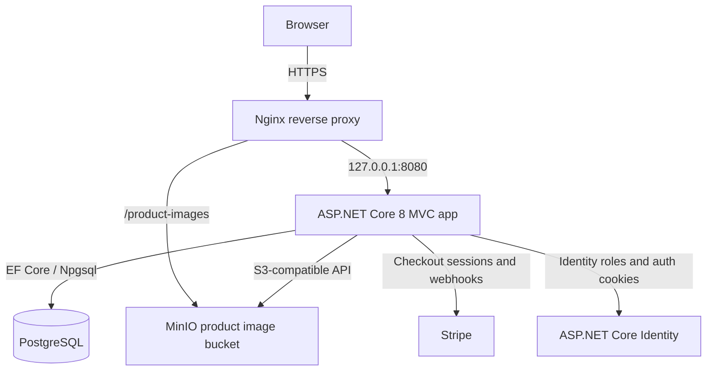

# VaultShop Architecture

VaultShop is a self-hosted ASP.NET Core 8 MVC e-commerce application deployed on a real Ubuntu VPS. The current architecture is intentionally simple: one monolithic web app, one PostgreSQL database, one MinIO object storage service, and Nginx as the public HTTPS reverse proxy.

## Deployment Boundaries

- Only Nginx is public on `80/443`.
- PostgreSQL is private to the host/Docker network.
- MinIO API and console are not exposed directly to the public internet.
- Product images are served through the public HTTPS domain instead of exposing MinIO directly.
- SSH/admin access is kept private through Tailscale.

## Application Boundaries

- Product image persistence goes through `IImageStorageService`.
- `ProductImage.ObjectKey` is the storage identity.
- `ProductImage.ImageUrl` is a browser-facing display URL.
- Checkout order creation is transactional through `CheckoutService`.
- Stripe payment status is updated through signed webhooks.
- Production-style deployments keep `Database__RunMigrationsOnStartup=false` and apply schema changes intentionally.

## Future Client Deployment Direction

VaultShop remains the public portfolio/demo deployment. A future real client deployment should be a separate single-tenant installation using the same codebase shape but with isolated configuration:

- Separate domain/subdomain.
- Separate PostgreSQL database and user.
- Separate MinIO bucket and credentials.
- Separate Stripe keys and webhook secret.
- Separate backups and restore verification.
- Separate branding configuration and private assets.

This avoids premature multi-tenancy while keeping the system maintainable.
